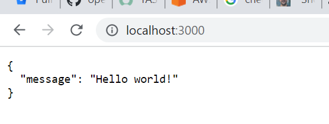
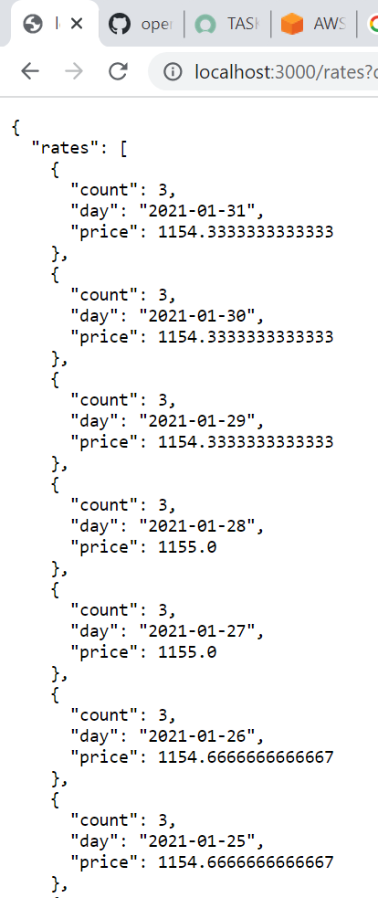

# Xeneta Operations Task

## Practical case: Deployable development environment

**Pre-requisites:-**

In order to run the Rates application, we need the below tools installed -

1. Python
2. Docker Desktop

**Rationale Describing the Tools Used :-**

Docker is being used to deploy the application. It has the below components :
1. Rates PostgresDB - Dockerfile inside db folder defines the configuration being used to launch the database.
2. Rates Frontend - Dockerfile inside rates folder holds the frontend application configuration being used.

docker-compose file is the central file which will start containers corresponding to each component and will enable communication from Frontend to PostgresDB. 


**Steps to Run the app :-**

1. Clone the github repository.
2. Open terminal and run the command : 
```
docker-compose up
```
3. This will build 2 images and spin up 2 containers each for PostgresDB and Frontend rates application
4. The config parameters in config.py have been replaced by docker ENV variables in python like -
```
os.getenv('NAME'), os.getenv('USER'), os.getenv('HOST'), os.getenv('PASSWORD')
```
5. The application can be validated at - http://localhost:3000/



6. The average rates between ports can be validated at - http://localhost:3000/rates?date_from=2021-01-01&date_to=2021-01-31&orig_code=CNGGZ&dest_code=EETLL




## Theoretical Case: Data ingestion pipeline

Attached in the repo is the pipeline_architecture.docx file which contains the following sections -

1. System Overview and Proposed Design
2. High Level Architecture Diagram
3. Application Monitoring
4. Bottlenecks and Proposed Solution
5. Additional Requirements Design Change